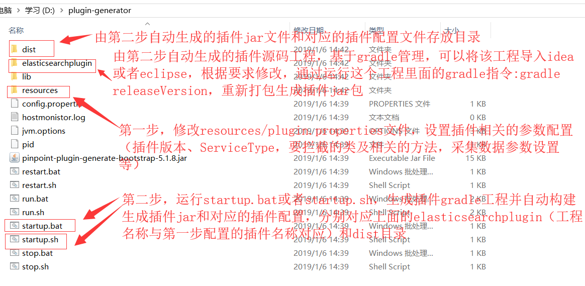

This is a pinpoint agent plugin generate tool，has two functions: 

1. generator plugin gradle project.
2. build and archive the plugin jar,config and images.



以分布式全文检索elasticsearch客户端框架[bboss elasticsearch](https://www.oschina.net/p/bboss-elastic)为实例，介绍服务调用链路日志采集插件的生成及集成方法，

需要被拦截监控的bboss elasticsearch组件类文件如下：
````
org.frameworkset.elasticsearch.client.ConfigRestClientUtil
org.frameworkset.elasticsearch.client.RestClientUtil
````
# 第1章	pinpoint插件生成工具概述
````
pinpoint默认提供大量通用组件和服务链路日志采集插件，如果需要监控应用系统自带的类文件，需要自行实现agent plugin，有点复杂并且容易出错；我们基于bboss，编写了这个快速生成pinpoint agent插件的工具包。
通过bboss pinpoint plugin genertor tool，只需要做一些简单的配置，即可快速生成应用系统自带类文件监控插件以及对应的插件集成部署文档，而且通过参数配置可以保留生成插件gradle源码工程，
可以在源码工程的基础上进行修改和调整，从而做出更加强大的监控插件出来。

````

# 第2章 准备 
````
安装jdk 1.6+
安装gradle 4+，并配置好环境变量
下载工具源码
````
# 第3章 通过gradle构建发布工具

gradle clean releaseVersion

# 第4章 使用工具生成插件
gradle构建成功后，在build/distributions目录下会生成可以运行的zip包，解压工具到目录plugin-generator，并切换到该目录下

## 步骤1 配置生成插件脚本
修改文件plugin-generator/resource/plugin.properties:
````
# 自定义插件属性描述文件，工具根据本描述文件生产类的监控插件
## 定义插件作者
plugin.author=yinbp

## 定义插件版本号
plugin.version=0.0.1
## 定义插件名称
plugin.name=bbosselastic

## 定义插件服务名称
plugin.serviceName=BBossElastic

## 定义插件程序对应的类路径
plugin.package=org.test.plugin.bbosselastic

## 插件采集的链路日志类型：
 spanevent，上下文环境没有trace，丢弃日志数据，有trace则加入其中，日志被记录,spanevent类型用于生成普通的日志采集插件
 spantrace(默认值), 上下文环境没有trace，创建trace并记录日志数据，有trace则加入其中，spantrace即可用于生成普通的日志采集插件，亦可以用于生成服务器端点使用的插件
##
plugin.interceptor.type=spantrace

## 定义插件对应的服务类型代码，serviceType需要向开发组申请，必须保持全局唯一,并且是short类型的数字
## 数值空间含义说明
	UNDEFINED_CATEGORY((short)-1, (short)-1),
    PINPOINT_INTERNAL((short)0, (short)999),
    SERVER((short)1000, (short)1999),
    DATABASE((short)2000, (short)2999),
    LIBRARY((short)5000, (short)7999),
    CACHE_LIBRARY((short)8000, (short)8999, BaseHistogramSchema.FAST_SCHEMA),
    RPC((short)9000, (short)9999);
    
    ServiceType Code Pinpoint 团队给出的私有区域范围
    
    类型	范围
    Server	1900 ~ 1999
    DB Client	2900 ~ 2999
    Cache Client	8900 ~ 8999
    RPC Client	9900 ~ 9999
    Others	7500 ~ 7999
## 类型配置
plugin.serviceType=1027

##
# plugin.interceptor.type为spantrace时必须同时指定一个eventServiceType类型
##
plugin.eventServiceType=1028

## 参数AnnotationKey，需要向开发组申请，必须保持全局唯一,并且是short类型的数字
## AnnotationKey 的 code 字段也是全局唯一的，Pinpoint 团队给出的私有区域范围是 900 到 999
plugin.argKeyCode=911
plugin.argKeyName=911.args

## 定义默认是否启用插件
profiler.enable=true

## 定义是否采集被监控类方法的返回数据，返回数据中包含对象时，请自行提供对象的toString()方法，一般不要开启采集方法返回值的机制，严重影响性能
profiler.recordResult=false

## 定义是否采集方法参数，方法参数中包含对象时，请自行提供对象的toString()方法
profiler.recordArgs=true

## 定义需要被监控的类及类方法信息，多个类用空格分隔
## 类的方法信息通过|追加在类路径后面，多个方法用逗号分隔，方法信息定义语法,包含两部分：mehtodName pattern+控制标识符号
# mehtodName pattern：方法名称模式后面可以也只有后面可以跟*符号，三种场景：
   send  全名称方法  
   send*  以send开头的方法  
   *  所有方法
 控制标识符号：两个值
           ~1  标识方法需要被拦截并采集链路日志
           ~0  标识方法不被拦截，不采集链路日志
# 举例说明：           
 * 拦截所有方法，还可以指定特殊的需要排除拦截的方法
 *~1 拦截所有方法，还可以指定特殊的需要排除拦截的方法
 *~0 不拦截所有方法，还可以指定特殊的需要拦截的方法
 methodA 拦截名称为methodA对应的方法
 methodB 拦截名称为methodB对应的方法
 methodB* 拦截名称以methodB开头的方法

 methodA~1 拦截名称为methodA对应的方法
 methodB~1 拦截名称为methodB对应的方法
 methodB*~1 拦截名称以methodB开头的方法

 methodA~0 不拦截名称为methodA对应的方法
 methodB~0 不拦截名称为methodB对应的方法
 methodB*~0 不拦截名称以methodB开头的方法
 上面的定义可以任意组合定义
 注意：类信息和方法描述信息间不能有空格，因为空格为不同类的分隔符
## 需要拦截类和方法举例说明
plugin.interceptor.classes=org.frameworkset.elasticsearch.client.ConfigRestClientUtil|*,discover~0 \                           
                           org.frameworkset.elasticsearch.client.RestClientUtil|*,discover~0

##
# Pinpoint 的拦截器可以任意拦截方法，因此被拦截的方法之间可能会有调用关系，
# 这会导致追踪数据被重复收集，因此 Pinpoint 提供了 Scope 和 ExecutionPolicy 功能。
# 在一个 Scope 内，可以定义拦截器的执行策略：是每次都执行 (ExecutionPolicy.ALWAYS)，
# 还是在没有更外层的拦截器存在的时候执行 (ExecutionPolicy.BOUNDARY)，
# 或者必须在有外层拦截器存在的时候执行 (ExecutionPolicy.INTERNAL)
# ALWAYS,
# BOUNDARY,
# INTERNAL
##
plugin.executionPolicy = BOUNDARY

## 生成插件完毕后，是否清空生成过程中产生的插件源码工程（基于gradle)，true 清空 false 不清空
plugin.deleteFilesAfterGen=false

````

## 步骤2 生成插件
````
windows执行plugin-generator/startup.bat指令，linux执行plugin-generator/startup.sh，从而生成插件jar包和插件集成操作说明文档：

插件jar包所在目录：
plugin-generator/dist/bbosselastic-0.0.1.jar
插件集成帮助文档所在目录：
plugin-generator/dist/plugin.config
````
## 步骤3插件集成
参考生成的帮助文档plugin-generator/dist/plugin.config集成插件.

以下是为分布式全文检索elasticsearch客户端框架[bboss elasticsearch](https://www.oschina.net/p/bboss-elastic)自动生成的插件集成帮助文档plugin.config内容：
````
#1 分发插件包
分发插件包
步骤1 分发插件包(bbosselastic-0.0.1.jar)到collector部署目录（以实际目录为准）：
/home/elk/apache-tomcat-8.0.42-collector/webapps/collector/WEB-INF/lib
然后重启collector

步骤2 分发插件包(bbosselastic-0.0.1.jar)到web控制台部署目录（以实际目录为准）：

/home/elk/tomcat-7.0.57-web/webapps/ROOT/WEB-INF/lib
然后重启web


步骤3 分发插件包(bbosselastic-0.0.1.jar)到被监控应用探针agent部署目录（以实际目录为准）：
插件对应应用被监控应用探针agent/plugin目录，

步骤4 将以下内容添加到探针配置文件agent/pinpoint.config文件中,然后重启采用这个探针的相关应用：
profiler.bbosselastic.enabled=true
profiler.bbosselastic.recordResult=false
profiler.bbosselastic.recordArgs=true


#2 分发dist/images下的图标到web控制台部署目录
两张插件的logo图片，一张大图images/servermap/BBossElastic.png，一张小图images/icons/BBossElastic.png,图标名称为plugin.serviceName对应的值，例如：
BBossElastic.png

拷贝图片到路径（以实际目录为准）：
小图标路径地址：/home/elk/tomcat-7.0.57-web/webapps/ROOT/images/icons/BBossElastic.png
大图标路径地址：/home/elk/tomcat-7.0.57-web/webapps/ROOT/images/servermap/BBossElastic.png

需要将服务类型和图片名称加入js文件/components/server-map2/jquery.ServerMap2.js的htIcons 中：（1.7.3以后的版本不需要加）
Then, add ServiceType name and the image file name to htIcons in
/components/server-map2/jquery.ServerMap2.js

"htIcons": {

。。。。。。。。。。。
'BBossElastic': 'BBossElastic.png'
},

````

## 技术交流群:166471282 

## 微信公众号:bbossgroup   


## License

The BBoss Framework is released under version 2.0 of the [Apache License][].

[Apache License]: http://www.apache.org/licenses/LICENSE-2.0

 

